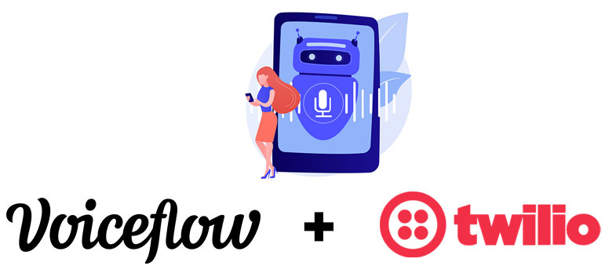
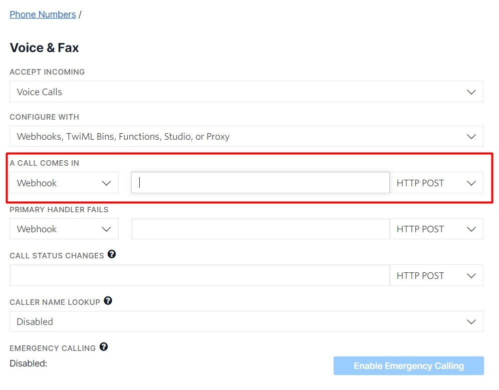
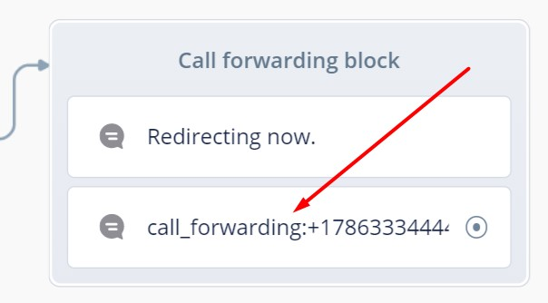

<p align="center">
  
  
</p>

{ width=50% }

## VoiceFlow - Twilio IVR
This is a Flask app to link your VoiceFlow project with your 
Twilio phone number and create an IVR.  

Go to VoiceFlow and grab your Project Version ID and your API Key.  

Add them to your Python environment variables with the names:  
```text
VF_PROJECT_VERSION_ID
VF_API_KEY
```

Deploy your Flask app (out of this scope) and copy your app URL.
  
Then go to Twilio and paste your app's URL as the webhook for the incoming calls 
to your phone number.  


<br>

#### Features
1. The script will handle VF choices block to let you input each choice as
number options in the phone dial pad.
   
2. To forward a call, just use the text __call_forwarding__ followed by the phone 
number to redirect the call. For example:  
   


<br>

#### Known issues:
- Audio support: The issue is that when you upload a file to VF using the Audio 
  block, the URL you get in the API is pointing to an __application/octet-stream__
  MIME type and Twilio API does not support that kind of audio files.  
  A possible solution could be just place the URL to your correct encoded audio
  file in VF.


<br>
<br>

#### About this project

This project was created by:
<br>
__Daian Gan__<br>
Github: [daiangan](https://github.com/daiangan)<br/>
E-mail: daian@ganmedia.com<br/>
Website: https://daiangan.com<br/>